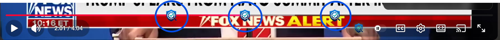

# ClaimSift

ClaimSift is a Chrome extension that analyzes YouTube video transcripts, identifies check-worthy factual claims, and displays timestamped fact-check overlays while the video plays.
It also places ClaimSift markers above the YouTube progress bar so viewers can see where upcoming fact checks will appear.

> ClaimSift is currently an MVP and is under active development.

---

## Demo

### ClaimSift in action

ClaimSift processes the current YouTube video, identifies factual claims, and automatically displays a fact-check overlay when playback reaches the corresponding timestamp.

---

### Progress-bar fact-check markers

<!-- Replace with a screenshot showing multiple ClaimSift markers above the YouTube timeline -->


ClaimSift markers appear above the YouTube progress bar at timestamps where fact checks are available.

The markers are passive visual indicators. They do not alter playback or require user interaction.

---

## Verdict examples

### True

<!-- Replace with a screenshot showing a TRUE verdict -->


A `TRUE` verdict indicates that the available fact-check evidence supports the extracted claim.

---

### False

<!-- Replace with a screenshot showing a FALSE verdict -->


A `FALSE` verdict indicates that the available fact-check evidence contradicts the extracted claim.

---

### Inconclusive

<!-- Replace with a screenshot showing an INCONCLUSIVE verdict -->


An `INCONCLUSIVE` verdict indicates that ClaimSift could not find sufficiently reliable evidence to confidently support or reject the claim.

ClaimSift intentionally avoids forcing a true-or-false verdict when the available evidence is weak, unclear, or incomplete.

---

## How it works

```text
YouTube video
      ↓
Transcript extraction
      ↓
Transcript chunking
      ↓
Gemini Flash-Lite claim extraction
      ↓
Claim validation, deduplication, and ranking
      ↓
Google Fact Check API
      ↓
TRUE / FALSE / INCONCLUSIVE
      ↓
Timestamped overlay and progress markers